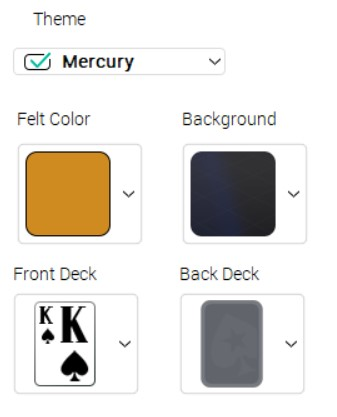

# Poker Bot

## Disclaimer

This project was made for educational purposes only. It was NOT made to be used to profit on any poker website, it was purely made as a side project to learn data science concepts.

Do NOT use this algorithm on any poker website as it is ILLEGAL. Any PR or issue that mentions the use of this project on poker websites will not be entertained.

## Credits

Pokerstars card detection based off: <https://github.com/nowakowsky/Pokerstars-Api>

Monte Carlo calculator from: <https://github.com/ktseng/holdem_calc>

## How to

1. Ensure that your board has the following theme settings: 

2. Open cmd as admininstrator (Tesseract-OCR requires admin privilages)
3. run `python main.py`

## Installing Dependancies

1. Install pipenv: `pip install pipenv`
2. Clone repo
3. Install tesseract binaries: <https://github.com/UB-Mannheim/tesseract/wiki>
4. Add tesseract install directory to PATH
5. Navigate to directory and install packages: `pipenv install`
